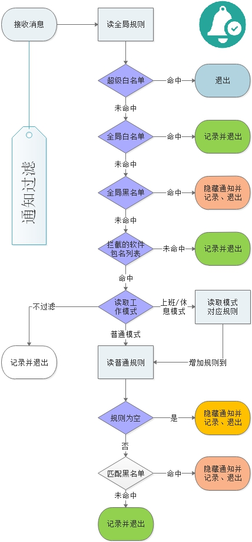
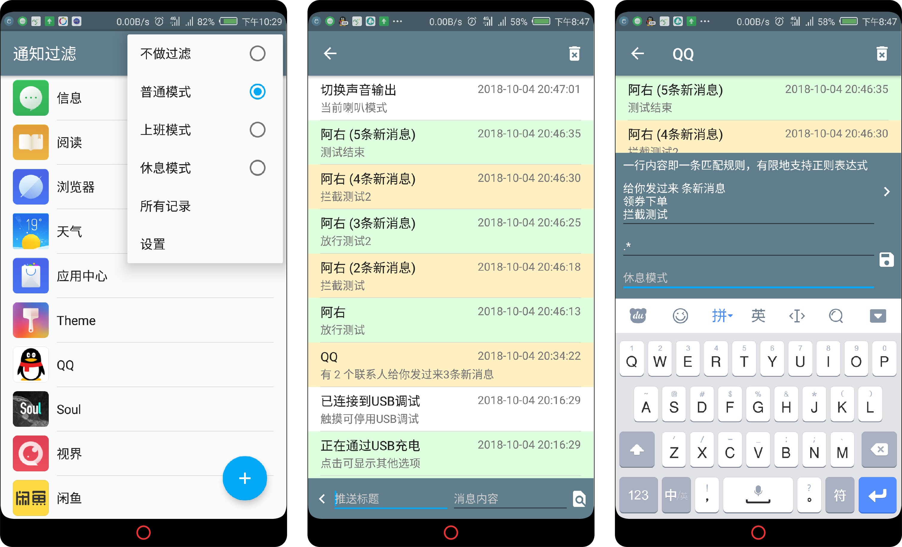

# NotificationBox

## Download

- [Coolapk Download](https://www.coolapk.com/apk/203350)
- [Github Release](https://github.com/tumuyan/NotificationBox/releases)

## 中文说明
* 这是对gavinliu的[消息盒子](https://github.com/gavinliu/NotificationBox)Fork并修改的一个版本
* 对Android通知进行拦截，自定义拦截应用。
* 记录通知的历史。
* 支持Android 4.4.4及更高版本的设备。

增加的功能和说明：
* 由于个人能力不足，只能对界面和功能做有限的更新。
* 请务必给此应用自启的权限并列于后台白名单，以免拦截失效。包括但不限于：权限管理、XX管家、节电优化。
* 如果软件没有生效，请执行解决问题的第二大步骤：重启试试。
* 增加自定义内容过滤器（无需root和xp框架做到此功能的软件目前仅此一例）。有限地支持正则匹配。每行为一条匹配规则。当存在规则时，符合规则的消息被屏蔽，不符合规则的消息不会被屏蔽。
* 增加根据条件删除记录的功能

屏蔽规则原理：
     message=(推送标题+推送内容).replaceAll("\n",""); 
     rules[]=rule.split("\n");
     result=Pattern.matches(rules[i], message)

屏蔽规则范例：
     推送标题：阿右  推送消息：GN
     完全匹配的规则：阿右GN
     匹配标题的规则：阿右.*
     匹配消息的规则：.*GN
     建议在规则的前后方都写通配符，以增加匹配能力

## Features

* Block notification (with text filter)
* Notification history list
* Support android device 19+

## Todo

* Save ``PendingIntent`` (save notification action)

## Acknowledgements

- [RxAndroid](https://github.com/ReactiveX/RxAndroid)
- [LiteOrm](https://github.com/litesuits/android-lite-orm)
- [android-architecture](https://github.com/googlesamples/android-architecture)

## License

MIT
